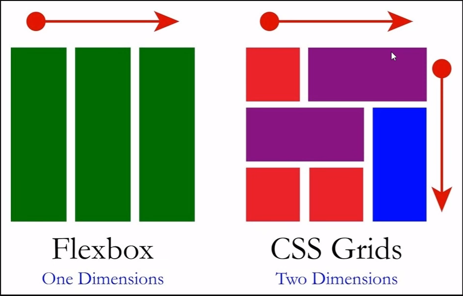
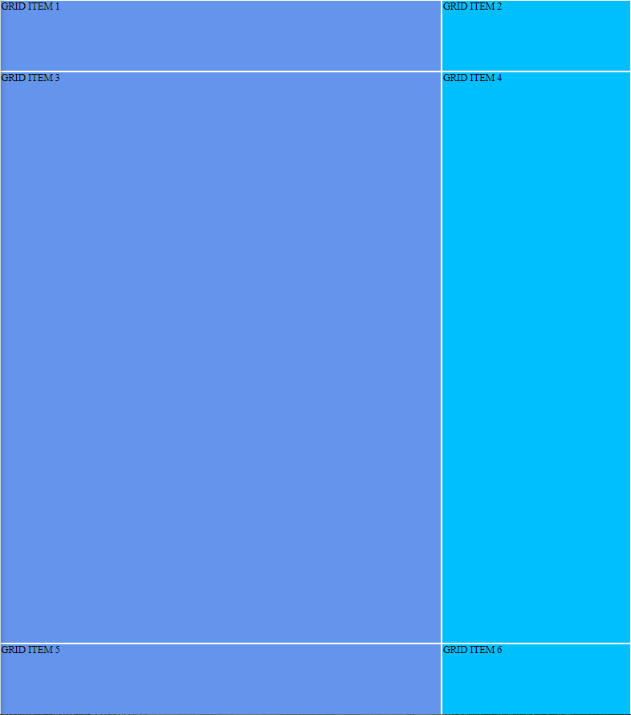

# cssGrid

It's important to mention that CSS Grid is a two dimensional layout mechanisms.

# Main concepts
There is a grid container that wraps all grid items. In the image above the invisible container that wraps all multicolors squares and rectangles is the grid container (the father's child).

The spaces between the items are called gaps.

And there is three elements that aren't exist in the DOM, but the browser create them to render and aline the elements:
1. grid-tracks: the columns and rows are tracks.
2. grid-lines: are the lines that surround the columns and rows.
3. grid-cells: the intersection of a row and grid (like a cell of ms excel).
4. grid-areas: any area limited by four grid-lines.

# Creating a Grid layout
As we mentioned, the first thing is declare a `display: grid;` rule in our element:

``` css
.grid-container{
    display: grid;
}
```
After apply that, nothing will change. Because we need to say in an explicit way what would be our layout template. To do that we use the grid-template rule, and we need to indicate the columns as well the rows.

Like that:
```css
.grid-container{
    display: grid;
    grid-template-columns: 70% 30%;
    grid-template-rows: 10% 80% 10%;
}
```
As a result of the code below we can get



An important aclaration is that we need to have one div as a grid container, and 6 child divs as a grid item.

## Fixed and relative units
You can set the columns or rows with pixels, but mostly we can take advantage of relative units like: %, rems, vw/vh.

It's important to know that with % you can get what you expect in terms of layout with no errors. And as an example you have the image above.

But another important relative unit is the fr. The fr unit means all the space available or a fraction of that. 

For example, if we can change the units in the example above but with almost no visual changes, we can write this:

```css
.grid-container{
    display: grid;
    grid-template-columns: 2fr 1fr;
    grid-template-rows: 10% 80% 10%;
}
```

Well, actually the output of the code above is the same as 80/20, not 70/30 like we write fristly.

### Repeat function

We can create a gallery, for instance, and all the images will have the same height and width we can use the repeat function to create 3 columns of 100px. Like this:

```css
.grid-container{
    display: grid;
    grid-template-columns: repeat(3, 100px);
    grid-template-rows: repeat(3, 100px);
}
```

And the result it will be:


Also, we can take advantage of the implicit things, make it the width and height of each image 100px tall and 100px 